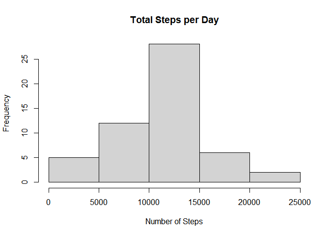
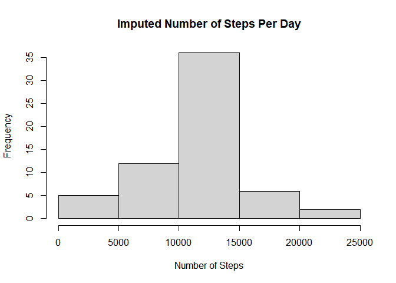
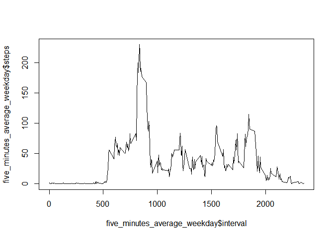
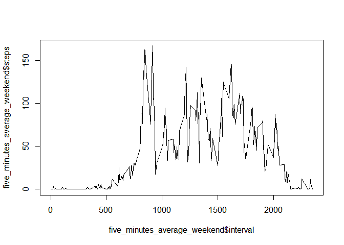

Loading and preprocessing the data
----------------------------------

We write code for downloading, creating an archive and placing the file
in the directory

    setwd('C:/Users/David/Downloads/John Hopkins/R/data')
    if(!file.exists('data')) dir.create('data')
    fileUrl <- 'https://d396qusza40orc.cloudfront.net/repdata%2Fdata%2Factivity.zip'
    download.file(fileUrl, destfile = 'C:/Users/David/Downloads/John Hopkins/R/data/repdata_data_activity.zip')
    unzip('C:/Users/David/Downloads/John Hopkins/R/data/repdata_data_activity.zip', exdir = 'C:/Users/David/Downloads/John Hopkins/R/data')
    activityData <- read.csv("activity.csv")

What is mean total number of steps taken per day?
-------------------------------------------------

We calculate the mean using aggregate and mean function and ignoring the
NA. We also input the data for the histogram

    totalSteps <- aggregate(steps ~ date, activityData, FUN=sum)

    hist(totalSteps$steps,
         main = "Total Steps per Day",
         xlab = "Number of Steps")

    meanSteps <- mean(totalSteps$steps, na.rm = TRUE)
    medSteps <- median(totalSteps$steps, na.rm = TRUE)

What is the average daily activity pattern?
-------------------------------------------

For the average daly pattern, we plot 5-minute intervals that we
previously calculated using the mean. We also calculate de max number of
steps of any interval

    library(ggplot2)

    ## Warning: package 'ggplot2' was built under R version 4.0.3

    meanStepsByInt <- aggregate(steps ~ interval, activityData, mean)
    ggplot(data = meanStepsByInt, aes(x = interval, y = steps)) +
      geom_line() +
      ggtitle("Average Daily Activity Pattern") +
      xlab("5-minute Interval") +
      ylab("Average Number of Steps") +
      theme(plot.title = element_text(hjust = 0.5))

    maxInt <- meanStepsByInt[which.max(meanStepsByInt$steps),]

Imputing Missing Values
-----------------------

We use the function to calculate number of missing values in the
dataset.

    missingVals <- is.na(activityData$steps)

Missing vallues=17568

We then fill the dataset so it doesn’t have missing values

    imp_activityData <- transform(activityData,
                                  steps = ifelse(is.na(activityData$steps),
                                                 meanStepsByInt$steps[match(activityData$interval, 
                                                                            meanStepsByInt$interval)],
                                                 activityData$steps))

We now plot the histogram

    impStepsByInt <- aggregate(steps ~ date, imp_activityData, FUN=sum)
    hist(impStepsByInt$steps,
         main = "Imputed Number of Steps Per Day",
         xlab = "Number of Steps")

We calculate the means to calculate the difference we were asked

    impMeanSteps <- mean(impStepsByInt$steps, na.rm = TRUE)
    impMedSteps <- median(impStepsByInt$steps, na.rm = TRUE)
    diffMean = impMeanSteps - meanSteps
    diffMed = impMedSteps - medSteps
    diffTotal = sum(impStepsByInt$steps) - sum(totalSteps$steps)

\[1\] 10766.19
--------------

\[1\] 10766.19
--------------

Theres 0 difference in the mean of the 2 datasets.

There is a difference of -1.076381110^{4} in the median steps of the two
dataset. There is a difference of 8.612950910^{4} in the total steps of
the two dataset.

Are there differences in activity patterns between weekdays and weekends?
-------------------------------------------------------------------------

We create the new factor with the levels weekday and weekend. We use the
dataset without the missing values

    library(psych)

    ## Warning: package 'psych' was built under R version 4.0.3

    ## 
    ## Attaching package: 'psych'

    ## The following objects are masked from 'package:ggplot2':
    ## 
    ##     %+%, alpha

    library(lubridate)

    ## Warning: package 'lubridate' was built under R version 4.0.3

    ## 
    ## Attaching package: 'lubridate'

    ## The following objects are masked from 'package:base':
    ## 
    ##     date, intersect, setdiff, union

    week <- wday(imp_activityData$date)
    week_day <- week
    for (i in 1:17568) # loop to find the na
    {
        if(week[i] == 1)
            week_day[i] <- 'weekend'
        if(week[i] == 2)
            week_day[i] <- 'weekday'
        if(week[i] == 3)
            week_day[i] <- 'weekday'
        if(week[i] == 4)
            week_day[i] <- 'weekday'
        if(week[i] == 5)
            week_day[i] <- 'weekday'
        if(week[i] == 6)
            week_day[i] <- 'weekday'
        if(week[i] == 7)
            week_day[i] <- 'weekend'
    }

     
    imp_activityData$weekday <-week_day

Finding the elements by “weekday” or “weekend” What is the average daily
activity pattern?

Make a time series plot of the 5-minute interval (x-axis) and the
average number of steps taken, averaged across all days (yaxis)

    weekday <- grep("weekday",imp_activityData$weekday)
    weekday_frame <- imp_activityData[weekday,]
    weekend_frame <- imp_activityData[-weekday,]

    five_minutes_average_weekday <- aggregate(steps~interval, data=weekday_frame, FUN=mean, na.rm=TRUE)
    five_minutes_average_weekend <- aggregate(steps~interval, data=weekend_frame, FUN=mean, na.rm=TRUE)

    plot(x = five_minutes_average_weekday$interval, y = five_minutes_average_weekday$steps, type = "l")

    plot(x = five_minutes_average_weekend$interval, y = five_minutes_average_weekend$steps, type = "l") 

“C:/Users/David/Downloads/John Hopkins/R/data/PA1\_template.Rmd”
